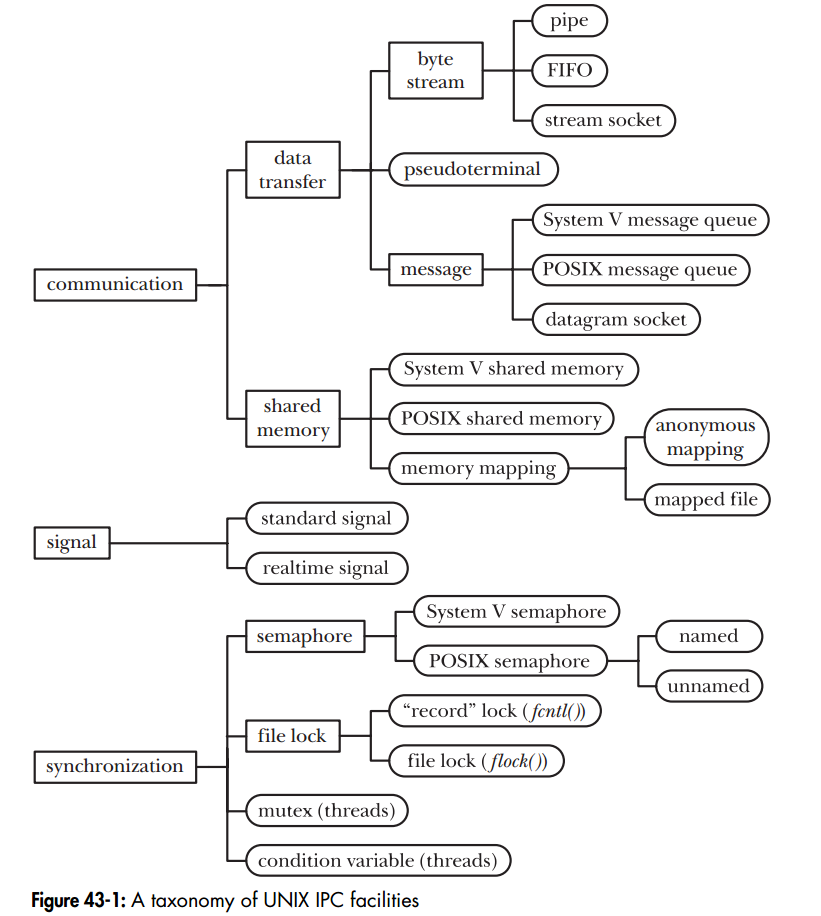

# Python 多进程、多线程
线程间资源是共享的，讲安全：信号量，锁，原子操作

进程间资源是独立的，讲通讯：管道，共享内存

## 进程间通信方式
下图取自 The Linux Programming Interface---chapter 43

## Python IPC

[Exchanging objects between processes](https://docs.python.org/3/library/multiprocessing.html#exchanging-objects-between-processes)

## Python threading
https://docs.python.org/3/library/threading.html#module-threading