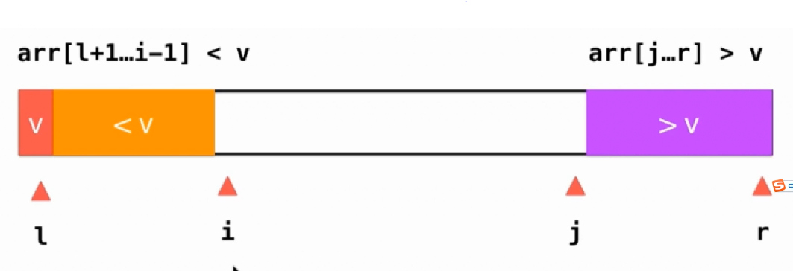

## sort
### quick_sort
单路快排

双路快排

三路快排


单路快排代码
```python
a = [5, 4, 3, 2, 1]

def quick_sort(my_list):
    def swap(i, j):
        my_list[i], my_list[j] = my_list[j], my_list[i]

    def _divide(left, right):
        j = left
        i = left + 1
        
        while i <= right:
            if i >= my_list[left]:
                i += 1
            else:
                swap(i, j + 1)
                j += 1
                i += 1
        swap(left, j)
        return j


    def _quick_sort(left, right):
        if left >= right:
            return 
        i = _divide(left, right)
        _quick_sort(left, i - 1)
        _quick_sort(i + 1, right)

    _quick_sort(0, len(my_list) - 1)

print(a)
quick_sort(a)
print(a)
```
双路快排
```python
    def _divide(left, right):
        i = left + 1
        j = right

        while True:
            while i <= right and my_list[i] < my_list[left]:
                i += 1
            while j >= left + 1 and my_list[j] > my_list[left]:
                j -= 1
            if i > j:
                break
            swap(i, j)
            i += 1
            j -= 1
        
        swap(left, j)

        return j
```