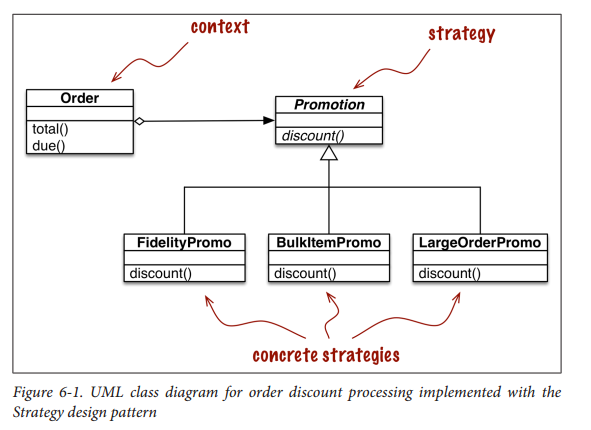
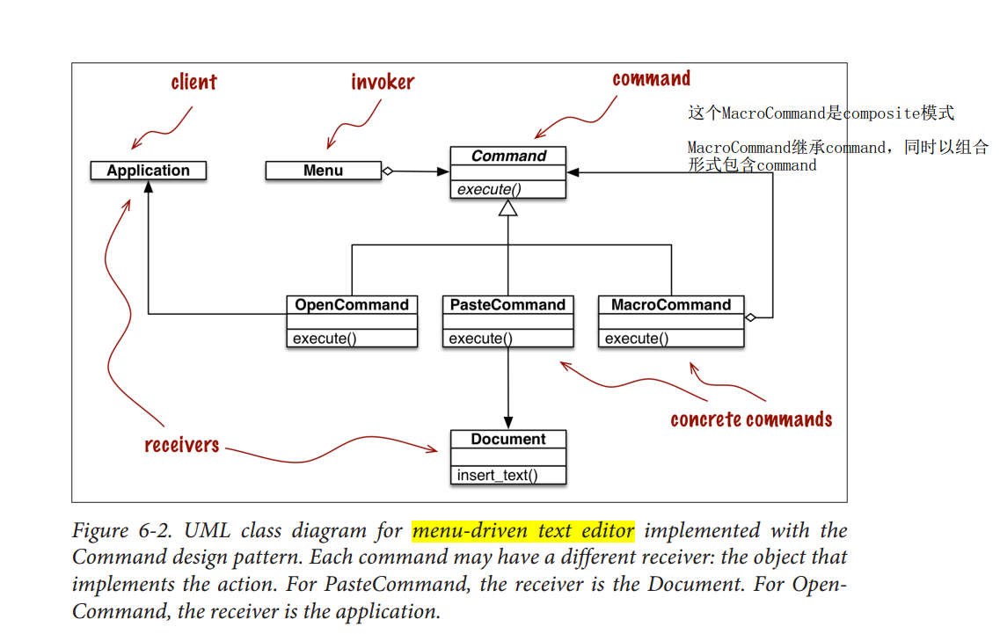

## 策略模式 --- strategy pattern

## 命令模式 --- command pattern

## 策略模式与命令模式的区别 
http://blog.csdn.net/loganwong/article/details/24799003

http://blog.csdn.net/jiafu1115/article/details/6980423

https://www.cnblogs.com/ChinaHook/p/7475777.html

 

总结来说，策略模式替换   某个算法的，例如排序问题中多种算法

而命令者模式 目标是    存在invoker 和 receiver，invoker发布不同的命令，不同的接收者接收不同的命令，该设计模式是将  invoker  和 receiver之间进行解耦合。

 

策略模式对付的问题域通常是一个，就是说，多个策略只是处理同一个问题，而命令模式对付的是多个问题域，就是很多不同的命令来做不同的事情。